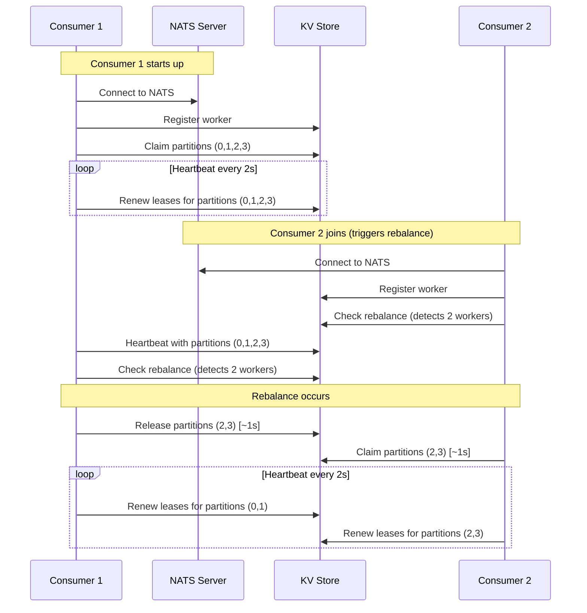
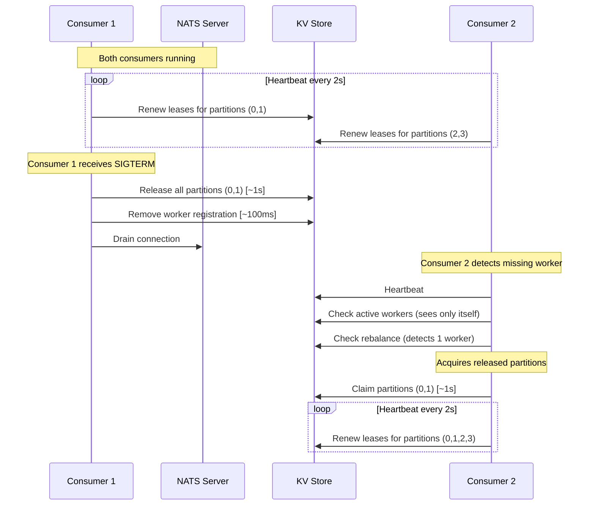
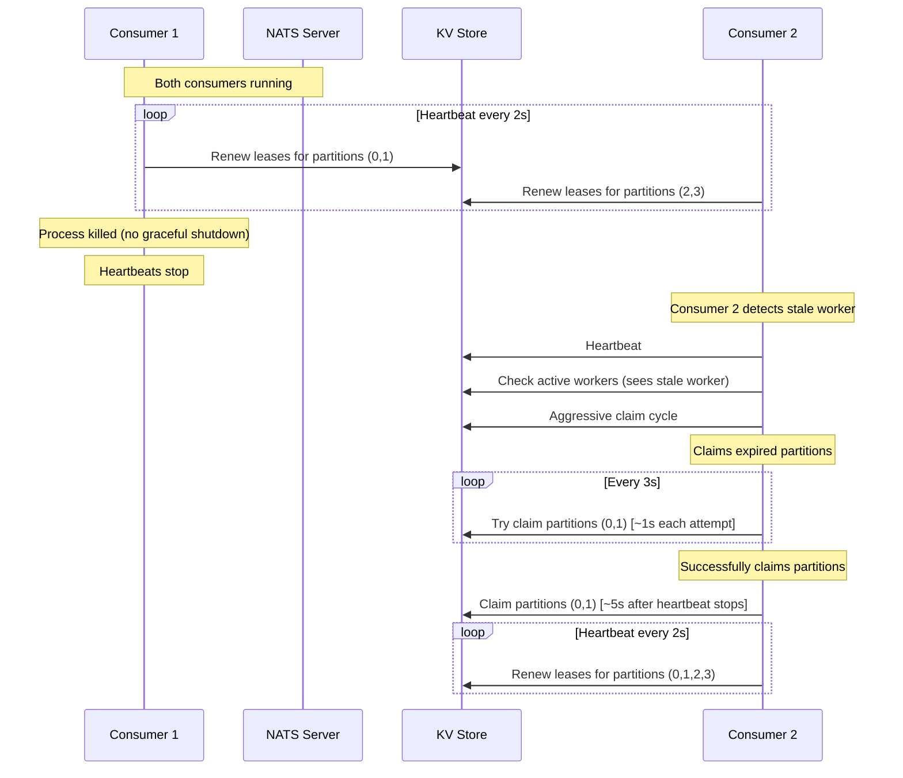
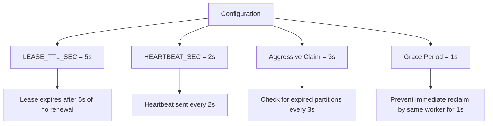

# Consumer Lifecycle Use Cases

## 1. Normal Consumer Join

**Timeline:**
- 0s: Consumer 2 starts
- 2s: Rebalance detected
- 3s: Partitions released and claimed
- **Total time for rebalance: ~3 seconds**

---

## 2. Normal Consumer Leave (Graceful Shutdown)

**Timeline:**
- 0s: Consumer 1 receives SIGTERM
- 1s: Partitions released
- 3s: Consumer 2 detects missing worker
- 4s: Partitions claimed by Consumer 2
- **Total time for failover: ~4 seconds**

---

## 3. Force Consumer Leave (Process Killed)

**Timeline:**
- 0s: Consumer 1 process killed
- 2s: Consumer 2 detects missing heartbeat
- 5s: First claim attempt
- 8s: Second claim attempt
- 11s: Partitions successfully claimed
- **Total time for failover: ~11 seconds**

---

## 4. Configuration Parameters

## 5. Failover Timing Summary

| Scenario | Detection Time | Claim Time | Total Failover Time |
|----------|---------------|------------|-------------------|
| Normal Leave | Immediate | ~1s | ~1s |
| Force Leave | ~2s | ~9s | ~11s |
| Consumer Join | ~2s | ~1s | ~3s |

### Key Factors:
1. **Heartbeat Interval (2s)**: How often consumers update their status
2. **Lease TTL (5s)**: Time before a lease is considered expired
3. **Aggressive Claim (3s)**: How often to check for expired partitions
4. **Grace Period (1s)**: Prevents immediate reclaim by same worker